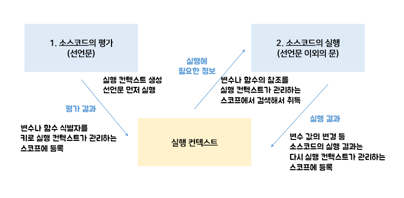

# 23장 - 실행 컨텍스트
`실행 컨텍스트는 자바스크립트의 동작 원리를 담고 있는 핵심 개념`이다.

---
## 23.1 소스코드의 타입 
4가지 타입의 소스코드는 `실행 컨텍스트를 생성`한다
구분하는 이유는 `소스코드의 타입에 따라 실행 컨텍스트를 생성하는 과정과 관리 내용이 다르기 때문`이다.

|소스코드의 타입|설명|
|--|--|
|전역 코드|전역에 존재하는 소스코드. 전역에 정의된 함수, 클래스 등의 내부 코드는 포함되지 않는다|
|함수 코드|함수 내부에 존재하는 소스코드. 함수 내부에 중첩된 함수, 클래스 등의, 내부 코드는 포함되지 않는다|
|eval 코드|빌트인 전역 함수인 eval 함수에 인수로 전달되어 실행되는 소스코드|
|모듈 코드|모듈 내부에 존재하는 소스코드를 말한다. 모듈 내부의 함수, 클래스 등의 내부 코드는 포함되지 않는다|

**1. 전역 코드**<br>
전역 변수를 관리하기 위해 최상위 스코프인 `전역 스코프`를 생성해야함. var키워드로 선언된 전역변수와 함수 선언문으로 정의된 전역 함수를 전역 객체의 프로퍼티와 메서드로 바인딩하고 참조하기 위해 전역 객체와 연결되어야 함. 이를 위해 전역 코드가 평가되면 `전역 실행 컨텍스트`가 생성

**2. 함수 코드**<br>
`지역 스코프`를 생성하고 지역 변수, 매개변수, arguments 객체를 관리해야 한다. 생성한 지역 스코프를 전역 스코프에서 시작하는 스코프 체인의 일원으로 연결해야 한다. 이를 위해 함수 코드가 평가되면 `함수 실행 컨텍스트`가 생성

**3. eval 코드**<br>
strict mode(엄격 모드)에서 자신만의 `독자적인 스코프`를 생성한다. 이를 위해 eval 코드가 평가되면 `eval 실행 컨텍스트`가 생성

**4. 모듈 코드**<br>
모듈별로 `독립적인 모듈 스코프`를 생성한다. 이를 위해 모듈 코드가 평가되면 `모듈 실행 컨텍스트`가 생성

---
## 23.2 소스코드의 평가와 실행
자바스크립트 엔진은 소스코드를 2개의 과정, 즉 `소스코드 평가`와 `소스코드 실행`과정으로 나누어 처리한다.

`소스코드 평가 과정`에서 실행 컨텍스트를 생성하고 변수, 함수 등의 선언문만 먼저 실행하여 생성된 변수나 함수 식별자를 키로 실행 컨텍스트가 관리하는 스코프에 등록한다.



소스코드 평가 과정이 끝나면 선언문을 제외한 소스코드가 순차적으로 실행된다.(런타임 시작) 이때 소스코드에서 필요한 정보인 변수나 함수의 참조를 실행 컨텍스트가 관리하는 스코프에서 검색해서 취득한다. 그리고 변수 값의 변경 등 소스코드의 실행 결과는 다시 실행 컨텍스트가 관리하는 스코프에 등록된다.

예를 들어
```javascript
var x;
x = 1;
```
위 예제를 2개의 과정으로 나누어 처리한다


**1. 소스코드의 평가 :** 변수 선언문 var x; 실행<br>
이때 생성된 변수 식별자 x는 실행 컨텍스트가 관리하는 스코프에 등록되고 undefined로 초기화된다.


**2. 소스코드의 실행 :** 변수 할당문 x = 1;만 실행된다. 이때 x변수에 값을 할당하려면 먼저 x변수가 선언된 변수인지 확인해야함. 이를 위해 실행 컨텍스트가 관리하는 스코프에 x변수가 등록되어 있는지 확인. x에 값을 할당하고 할당 결과를 실행 컨텍스트에 등록하여 관리한다.

---
## 23.3 실행 컨텍스트의 역할
전역 코드와 함수 코드로 구성되어 있는 아래 예제를 자바스크립트 엔진이 어떻게 평가하고 실행할까?

```javascript
    // 전역 변수 선언
    const x = 1;
    const y = 2;

    // 함수 정의
    function foo(a) {
        // 지역 변수 선언
        const x = 10;
        const y = 20;

        // 메서드 호출
        console.log(a + x + y); //130
    }

    // 함수 호출
    foo(100);

    // 메서드 호출
    console.log(x + y); //3
```
**1. 전역 코드 평가** <br>
전역 코드의 변수 선언문과 함수 선언문이 먼저 실행되고 그 결과 생성된 전역 변수와 전역 함수가 실행 컨텍스트가 관리하는 전역 스코프에 등록된다.

**2. 전역 코드 실행**<br>
런타임이 시작되어 전역 코드가 순차적으로 실행되기 시작한다. 이때 전역 변수에 값이 할당되고 함수가 호출된다.

**3. 함수 코드 평가**<br>
함수 호출에 의해 코드 실행 순서가 변경되어 함수 내부로 진입하면 함수 내부의 문들을 실행하기에 앞서 함수 코드 평가 과정을 거치며 함수 코드를 실행하기 위한 준비를 한다.<br>
매개변수와 지역 변수 선언문이 먼저 실행되고 그 결과 생성된 매개변수와 지역 변수가 실행 컨텍스트가 관리하는 지역 스코프에 등록된다. 또한 함수 내부에서 지역 변수처럼 사용할 수 있는 arguments객체가 생성되어 지역 스코프에 등록되고 this 바인딩도 결정된다

**4. 함수 코드 실행**<br>
런타임이 시작되어 함수 코드가 순차적으로 실행되기 시작한다. 매개변수와 지역 변수에 값이 할당되고 console.log 메서드가 호출된다. console.log 메서드의 실행이 종료되면 함수 코드 실행 과정이 종료되고 함수 호출 이전으로 되돌아가 전역 코드 실행을 계속한다

이처럼 코드가 실행되려면 스코프를 구분하여 식별자와 바인딩된 값이 관리되어야 한다. 그리고 중첩 관계에 의해 스코프 체인을 형성하여 식별자를 검색할 수 있어야 하고 전역 객체의 프로퍼티도 전역 변수처럼 검색할 수 있어야 한다.

아래와 같이 스코프, 식별자, 코드 실행 순서 등의 관리가 필요하다
1. 선언에 의해 생성된 모든 식별자를 스코프를 구분하여 등록하고 상태 변화를 지속적으로 관리할 수 있어야 한다.
2. 스코프는 중첩 관계에 의해 스코프 체인을 형성해야 한다.
3. 현재 실행 중인 코드의 실행 순서를 변경할 수 있어야 하며 다시 되돌아갈 수도 있어야 한다

이 모든 것을 관리하는 것이 바로 `실행 컨텍스트`다. **실행 컨텍스트는 소스코드를 실행하는 데 필요한 환경을 제공하고 코드의 실행 결과를 실제로 관리하는 영역이다**. 좀 더 구체적으로 이야기를 하면 **식별자를 등록하고 관리하는 스코프와 코드 실행 순서 관리를 구현한 내부 메커니즘으로 모든 코드는 실행 컨텍스트를 통해 실행되고 관리된다.**

식별자와 스코프는 `실행 컨텍스트의 렉시컬 환경`으로 관리하고 코드 실행 순서는 `실행 컨텍스트 스택`으로 관리한다.

---
## 23.4 실행 컨텍스트 스택

```javascript
const x = 1;

function foo () {
    const y = 2;

    function bar () {
        const z = 3;
        console.log(x+y+z);
    }

    bar();
}
foo(); //6
```
위 예제는 `전역 코드`와 `함수 코드`로 소스코드 타입이 이루어져 있다.

자바스크립트 엔진은 전역 코드 > 함수 코드로 실행되는데 이때 생성된 실행 컨텍스트는 스택 자료구조로 관리된다. 이를 `실행 컨텍스트 스택`이라고 부른다.


위 코드를 실행하면 코드가 실행되는 시간의 흐름에 따라 실행 컨텍스트 스택에 위와 같이 실행 컨텍스트가 추가나 제거가 된다

1. 전역 코드의 평가와 실행
2. foo 함수 코드의 평가와 실행
3. bar 함수 코드의 평가와 실행
4. foo 함수 코드로 복귀
5. 전역 코드로 복귀

`실행 컨텍스트 스택은 코드의 실행 순서를 관리한다.` 소스코드가 평가되면 실행 컨텍스트가 생성되고 실행 컨텍스트 스택의 최상위에 쌓인다. `실행 컨텍스트 스택의 최상위에 존재하는 실행 컨텍스트는 언제나 현재 실행 중인 코드의 실행 컨텍스트다.` 따라서 실행 컨텍스트 스택의 최상위 존재하는 실행 컨텍스트를 `실행 중인 실행 컨텍스트`라 부른다.

---
## 23.5 렉시컬 환경
식별자와 식별자에 바인딩된 값, 그리고 상위 스코프에 대한 참조를 기록하는 자료구조로 실행 컨텍스트를 구성하는 컴포넌트다.

실행 컨텍스트 스택이 코드의 실행 순서를 관리한다면 `렉시컬 환경은 스코프와 식별자를 관리한다`

키와 값을 갖는 객체 형태의 스코프를 생성하여 식별자를 키로 등록하고 식별자에 바인딩된 값을 관리한다.

🌟 즉, 렉시컬 환경은 스코프를 구분하여 식별자를 등록하고 관리하는 저장소 역할을 하는 렉시컬 스코프의 실체다

실행 컨텍스트는 LexicalEnvironment 컴포넌트와 VariableEnvironment 컴포넌트로 구성된다.

생성 초기에 이 두개의 컴포넌트는 하나의 동일한 렉시컬 환경을 참조한다. 이후 몇가지 상황을 만나면 VariableEnvironment 컴포넌트를 위한 새로운 렉시컬 환경이 생성하고, 이때부터 두개의 컴포넌트는 내용이 달라지는 경우도 있다. 하지만 이 책에서는 strict mode, eval 코드, try/catch 문과 같은 특수한 상황은 제외하고 두개의 컴포넌트도 구분하지 않고 렉시컬 환경으로 통일해 간략하게 설명되어 있다.

렉시컬 환경은 두개의 컴포넌트로 구성된다.
1. **환경 레코드 Environment Record**
스코프에 포함된 식별자를 등록하고 등록된 식별자에 바인딩된 값을 관리하는 저장소. 소스코드의 타입에 따라 관리하는 내용의 차이 존재

2. **외부 렉시컬 환경에 대한 참조 OuterLexicalEnvironmentReference**
상위 스코프를 가리킨다. 이때 상위 스코프란 외부 렉시컬 환경, 즉 해당 실행 컨텍스트를 생성한 소스코드를 포함하는 상위 코드의 렉시컬 환경을 말한다. 외부 렉시컬 환경에 대한 참조를 통해 단방향 링크드 리스트인 스코프 체인을 구현한다. 

---
## 23.6 실행 컨텍스트의 생성과 식별자의 검색 과정
🌟🌟🌟
```javascript
var x = 1;
const y = 2;

function foo (a) {
    var x = 3;
    const y = 4;

    function bar (b) {
        const z = 5;
        console.log(a+ b+ x+ y +z);
    }
    bar(10);
}

foo(20); //42
```
위의 예제를 통해 어떻게 실행 컨텍스트가 생성되고 코드 실행 결과가 관리되는지, 실행 컨텍스트를 통해 어떻게 식별자를 검색하는지 살펴보겠다

🌟🌟🌟

### 전역 객체 생성
전역 객체는 전역 코드가 평가되기 이전에 생성됨
전역 객체에 빌트인 전역 프로퍼티와 빌트인 전역 함수, 그리고 표준 빌트인 객체가 추가되며 동작 환경에 따라 클라이언트 사이트 Web API 또는 특정 환경을 위한 호스트 객체를 포함한다. 전역 객체도 프로토타입 체인의 일원이다.

### 전역 코드 평가
소스코드가 로드되면 자바스크립트 엔진은 전역 코드를 평가한다.
1. **전역 실행 컨텍스트 생성** <br>
비어있는 전역 실행 컨텍스트를 생성하여 실행 컨텍스트 스택에 푸시한다. 이때 전역 실행 컨텍스트는 실행 컨텍스트 스택의 최상위, 즉 실행 중인 실행 컨텍스트가 된다

2. **전역 렉시컬 환경 생성** <br>
전역 렉시컬 환경을 생성하고 전역 실행 컨텍스트에 바인딩한다. 렉시컬 환경은 2개의 컴포넌트, 즉 환경 레코드와 외부 렉시컬 환경에 대한 참조로 구성된다


<br> **2-1. 전역 환경 레코드 생성**<br>
전역 렉시컬 환경을 구성하는 컴포넌트인 전역 환경 레코드는 전역 변수를 관리하는 전역 스코프, 전역 객체의 빌트인 전역 프로퍼티와 빌트인 전역 함수, 표준 빌트인 객체를 제공한다.

모든 전역 변수가 전역 객체의 프로퍼티가 되는 ES6 이전에는 전역 객체가 전역 환경 레코드의 역할을 수행했다. 하지만 ES6의 let, const 키워드로 선언한 전역 변수는 전역 객체의 프로퍼티가 되지 않고 개념적 블록 내에 존재하게 된다.

이처럼 var키워드로 선언한 전역 변수와 let, const로 선언한 전역 변수를 구분하여 관리하기 위해 전역 스코프 역할을 하는 **전역 환경 레코드는 객체 환경 레코드와 선언적 환경 레코드로 구성되어있다** 

객체 환경 레코드 - 기존의 전역 객체가 관리하던 var 키워드로 선언한 전역 변수와 함수 선언문으로 정의한 전역 함수, 빌트인 전역 프로퍼티와 빌트인 전역 함수, 표준 빌트인 객체를 관리

선언적 환경 레코드 - let, const 키워드로 선언한 전역 변수 관리

객체 환경 레코드와 선언적 환경 레코드는 서로 협력하여 전역 스코프와 전역 객체를 관리한다


<br> **2-2. 객체 환경 레코드 생성**<br>
전역 환경 레코드를 구성하는 컴포넌트인 객체 환경 레코드는 BindingObject라고 부르는 객체와 연결된다. **BindingObject는 전역 객체 생성에서 생성된 전역 객체다**. 

**전역 코드 평가 과정에서 var키워드로 선언한 전역 변수와 함수 선언문으로 정의된 전역 함수는 전역 환경 레코드의 객체 환경 레코드에 연결된 BindingObject를 통해 전역 객체의 프로퍼티와 메서드가 된다** 이때 등록한 식별자를 전역 환경 레코드의 객체 환경 레코드에서 검색하면 전역 객체의 프로퍼티를 검색하여 반환한다

이것이 var 키워드로 선언된 전역 변수와 함수 선언문으로 정의된 전역 함수가 전역 객체의 프로퍼티와 메서드가 되고 전역 객체를 가리키는 식별자(window)없이 전역 객체의 프로퍼티를 참조할 수 있는 메커니즘이다

>📌  `변수 호이스팅이 발생하는 이유`<br>
var 키워드로 선언된 변수는 선언 단계와 초기화 단계가 동시에 진행된다. 전역 코드 평가 시점에 객체 환경 레코드에 바인딩된 BindingObject를 통해 전역 객체에 변수 식별자를 키로 등록한 다음, 암묵적으로 undefined를 바인딩한다. 따라서 var키워드로 선언한 변수는 코드 실행 단계에서 변수 선언문 이전에도 참조할 수 있다. 단, 변수 선언문 이전에 참조한 변수는 언제나 undefined다.

>📌  `변수 호이스팅과 함수 호이스팅의 차이`<br>
함수 선언문으로 정의한 함수가 평가되면 함수 이름과 동일한 이름의 식별자를 객체 환경 레코드에 바인딩된 BindingObject를 통해 전역 객체에 키로 등록하고 생성된 함수 객체를 즉시 할당한다. 즉, 함수 선언문으로 정의한 함수는 함수 선언문 이전에 호출할 수 있다.

<br> **2-3. 선언적 환경 레코드 생성**<br>
let과 const 키워드로 선언한 전역 변수는 선언적 환경 레코드에 등록되고 관리된다

```javascript
var x = 1;
const y = 2;
function foo(a){

};
```
📄 (23-13 자료 참고)

let과 const로 선언한 전역 변수는 전역 객체의 프로퍼티가 되지 않고 개념적인 블록 내에 존재하게 된다고 했는데 여기서 개념적 블록이 바로 전역 환경 레코드의 선언적 환경 레코드다.

전역 변수 y는 const키워드로 선언한 변수이므로 전역 객체의 프로퍼티가 되지 않기 때문에 window.y와 같이 전역 객체의 프로퍼티로서 참조할 수 없다. 또한 const 키워드로 선언한 변수는 선언 단계와 초기화 단계가 분리되어 진행한다. 따라서 초기화 단계, 즉 런타임에 실행 흐름이 변수 선언문에 도달하기 전에 `일시적 사각지대`에 빠지게 된다.

위 그림에서 채색되어 있는 부분인 y에 uninitialized 바인딩되어 있는 걸 보면 초기화 단계가 진행되지 않아 변수에 접근할 수 없음을 나타내기 위해 사용된 표현이다. 실제로 uninitialized라는 값이 바인딩된 것이 아니다

let, const 키워드로 선언한 변수도 변수 호이스팅이 발생하는 것은 변함이 없다. 단, 런타임에 컨트롤이 변수 선언문에 도달하기 전까지 일시적 사각지대에 빠지기 때문에 참조할 수 없다

```javascript
let foo = 1;
{
    // let키워드로 선언한 변수 여전히 호이스팅이 발생하기 때문에 참조에러 발생 (지역 변수에 있기 때문)
    console.log(foo); //ReferenceError (참조 에러 발생)
    let foo = 2;
}
```

**3. this바인딩**<br>
전역 환경 레코드의 GlobalThisValue 내부 슬롯에 this 바인딩된다. 일반적으로 전역 코드에서 this는 전역 객체를 가리키므로 GlobalThisValue 내부 슬롯에는 전역 객체가 바인딩된다. 전역 코드에서 this를 참조하면 전역 환경 레코드의 GlobalThisValue 내부 슬롯에 바인딩되어 있는 객체가 반환된다

📄 (23-14 자료 참고)

참고로 전역 환경 레코드를 구성하는 객체 환경 레코드와 선언적 환경 레코드에는 this 바인딩이 없다. this 바인딩은 전역 환경 레코드와 함수 환경 레코드에만 존재한다.

**4. 외부 렉시컬 환경에 대한 참조 결정**<br>

외부 렉시컬 환경에 대한 참조는 현재 평가 중인 소스코드를 포함하는 외부 소스코드의 렉시컬 환경, 즉 상위 스코프를 가리킨다. 이를 통해 단방향 링크드 리스트인 스코프 체인을 구현한다.

현재 평가 중인 소스코드는 전역 코드다. 전역 코드를 포함하는 소스코드는 없으므로 전역 렉시컬 환경의 외부 렉시컬 환경에 대한 참조에 null이 할당된다. 이는 전역 렉시컬 환경이 스코프 체인의 종점에 존재함을 의미한다

📄 (23-15 자료 참고)

### 전역 코드 실행

이제 전역 코드가 순차적으로 실행되기 시작한다. 변수 할당문이 실행되어 전역 변수 x,y에 값이 할당된다. 그리고 foo 함수가 호출된다

📄 (23-16 자료 참고)

변수 할당문 또는 함수 호출문을 실행하기 전에 먼저 변수 또는 함수 이름이 선언된 식별자인지 확인한다. 또한 식별자는 스코프가 다르면 같은 이름을 가질 수 있다. 즉, 동일한 이름의 식별자가 다른 스코프에 여러개 존재할 수도 있다. 따라서 어느 스코프의 식별자를 참조하면 되는지 결정할 필요가 있다. 이를 `식별자 결정`이라 한다

`식별자 결정을 위해 식별자를 검색할 때는 실행 중인 실행 컨텍스트에서 식별자를 검색하기 시작한다`. 선언된 식별자는 실행 컨텍스트의 렉시컬 환경의 환경 레코드에 등록되어 있다.

현재 실행 중인 실행 컨텍스트는 전역 실행 컨텍스트이므로 전역 렉시컬 환경에서 식별자 x,y,foo를 검색하기 시작한다.  만약 실행 중인 실행 컨텍스트의 렉시컬 환경에서 식별자를 검색할 수 없으면 외부 렉시컬 환경에 대한 참조가 가리키는 렉시컬 환경, 즉 상위 스코프로 이동하여 식별자를 검색한다.

이것이 바로 스코프 체인의 동작 원리다. 하지만 전역 렉시컬 환경은 스코프 체인의 종점이므로 전역 렉시컬 환경에서 검색할 수 없는 식별자는 참조 에러를 발생시킨다. 식별자 결정에 실패했기 때문이다

실행 컨텍스트는 소스코드를 실행하기 위해 필요한 환경을 제공하고 코드의 실행 결과를 실제로 관리하는 영역이다

### foo 함수 코드 평가
foo 함수가 호출되면 전역 코드의 실행을 일시 중지하고 foo 함수 내부로 코드의 제어권이 이동한다. 

**1. 함수 실행 컨텍스트 생성**<br>
먼저 foo함수 실행 컨텍스트를 생성한다. 생성된 함수 실행 컨텍스트는 함수 렉시컬 환경이 완성된 다음 실행 컨텍스트 스택에 푸시된다. 이때 foo 함수 컨텍스트는 실행 중인 실행 컨텍스트가 된다.

**2. 함수 렉시컬 환경 생성**<br>
foo 함수 렉시컬 환경을 생성하고 foo 함수 실행 컨텍스트에 바인딩한다

📄 (23-18 자료 참고)

렉시컬 환경은 2개의 컴포넌트, 즉 환경 레코드와 외부 렉시컬 환경에 대한 참조로 구성된다

**2-1. 함수 환경 레코드 생성**<br>
함수 렉시컬 환경을 구성하는 컴포넌트 중 하나인 함수 환경 레코드는 매개변수, arguments 객체, 함수 내부에서 선언한 지역 변수와 중첩 함수를 등록하고 관리한다.

📄 (23-19 자료 참고)

**2-2. this 바인딩**<br>
함수 환경 레코드의 ThisValue 내부 슬롯에 this가 바인딩된다. ThisValue에 바인딩될 객체는 함수 호출 방식에 따라 결정된다

foo 함수는 일반 함수로 호출되었으므로 this는 전역 객체를 가리킨다. 따라서 함수 환경 레코드의 ThisValue 내부 슬롯에 바인딩되어 있는 객체가 반환된다.

📄 (23-20 자료 참고)

**2-3. 외부 렉시컬 환경에 대한 참조 결정**<br>
외부 렉시컬 환경에 대한 참조에 foo 함수 정의가 평가된 시점에 실행 중인 실행 컨텍스트의 렉시컬 환경의 참조가 할당된다.

foo 함수는 전역 코드에 정의된 전역 함수다. 따라서 foo함수 정의는 전역 코드 평가 시점에 평가된다. 이 시점의 실행 중인 실행 컨텍스트는 전역 실행 컨텍스트다. 따라서 외부 렉시컬 환경에 대한 참조에는 전역 렉시컬 환경의 참조가 할당된다.

📄 (23-21 자료 참고)

자바스크립트는 `함수를 어디서 호출했는지가 아니라 어디에 정의했는지에 따라 상위 스코프를 결정한다`. 그리고 함수 객체는 자신이 정의된 스코프(상위 스코프)를 기억한다.

함수 객체를 생성할 때 현재 실행 중인 실행 컨텍스트의 렉시컬 환경, 즉 함수의 상위 스코프를 함수 객체의 내부 슬롯(Environment)에 저장한다. 함수 렉시컬 환경의 외부 렉시컬 환경에 대한 참조에 할당되는 것은 바로 함수의 상위 스코프를 가리키는 함수 객체의 내부 슬롯(Environment)에 저장된 렉시컬 환경의 참조다. 즉, 함수 객체의 내부 슬롯 Environment가 바로 렉시컬 스코프를 구현하는 메커니즘이다.

### foo 함수 코드 실행
이제 런타임이 시작되어 foo함수의 소스코드가 순차적으로 실행되기 시작한다<br> 매개변수에 인수가 할당되고 변수 할당문이 싫랭되어 지역 변수 x, y에 값이 할당된다. 그리고 함수 bar가 호출된다. 이때 `식별자 결정을 위해 실행 중인 실행 컨텍스트의 렉시컬 환경에서 식별자를 검색하기 시작한다` 실행 중인 실행 컨텍스트의 렉시컬 환경에서 식별자를 검색할 수 없으면 외부 렉시컬 환경에 대한 참조가 가리키는 렉시컬 환경으로 이동하여 식별자를 검색한다. 검색된 식별자에 값을 바인딩한다.

📄 (23-22 자료 참고)

### bar 함수 코드 평가

📄 (23-23 자료 참고)

### bar 함수 코드 실행

📄 (23-24 자료 참고)

매개변수에 인수가 할당되고, 변수 할당문이 실행되어 지역 변수 z에 값이 할당된다. 그리고 console.log가 실행된다

1. console 식별자 검색 <br>
먼저 console 식별자를 스코프 체인에서 검색한다. 식별자를 검색할 때 현재 실행 중인 실행 컨텍스트의 렉시컬 환경에서 검색하기 시작한다. <br><br>
실행 중인 실행 컨텍스트는 bar 함수 실행 컨텍스트다. 따라서 bar 함수 실행 컨텍스트의 bar 함수 렉시컬 환경에서 console 식별자를 검색하기 시작한다. 이곳에는 console 식별자가 없으므로 스코프체인 상의 상위 스코프인 외부 렉시컬 환경에 대한 참조가 가리키는 foo 함수 렉시컬 환경으로 이동하여 console 식별자를 검색한다. 이곳에도 console 식별자가 업으므로 외부 렉시컬 환경에 대한 참조가 가리키는 전역 렉시컬 환경으로 이동하여 console 식별자를 검색한다. 전역 렉시컬 환경은 객체 환경 레코드와 선언적 환경 레코드로 구성되어 있다. console 식별자는 객체 환경 레코드의 BindingObject를 통해 전역 객체에서 찾을 수 있다

2. log 메서드 검색 <br>
console 객체에서 log 메서드를 검색한다. 이때 console 객체의 프로토타입 체인을 통해 메서드를 검색한다.

3. 표현식 a+b+x+y+z의 평가<br>
console.log 메서드에 전달할 인수인 표현식을 평가하기 위해 각 식별자를 검색한다. 식별자는 스코프 체인, 즉, 현재 실행 중인 실행 컨텍스트의 렉시컬 환경에서 시작하여 외부 렉시컬 환경에 대한 참조로 이어지는 렉시컬 환경의 연속에서 검색한다.

📄 (23-25 자료 참고)

4. console.log 메서드 호출<br>
표현식이 평가되어 생성한 값을 console.log 메서드에 전달하여 호출한다

### bar 함수 코드 실행 종료
실행 컨텍스트 스택에서 bar 함수 실행 컨텍스트가 팝되어 제거되고 foo 실행 컨텍스트가 실행 중인 실행 컨텍스트가 된다

📄 (23-26 자료 참고)

실행 컨텍스트에서 bar 함수 실행 컨텍스트가 제거되었다고 해서 bar 함수 렉시컬 환경까지 즉시 소멸하는 것은 아니다. 렉시컬 환경은 실행 컨텍스트에 의해 참조되긴 하지만 독립적인 객체다. 

객체를 포함한 모든 값은 누군가에 의해 참조되지 않을 때 가비지 컬렉터에 의해 메모리 공간의 확보가 해제되어 소멸한다

### foo 함수 코드 실행 종료
실행 컨텍스트 스택에서 foo 함수 실행 컨텍스트가 팝되어 제거되고 전역 실행 컨텍스트가 실행 중인 실행 컨텍스트가 된다

📄 (23-27 자료 참고)

### 전역 코드 실행 종료
실행 컨텍스트 스택에는 아무것도 남아있지 않다

---
## 23.7 실행 컨텍스트와 블록 레벨 스코프
var 키워드로 선언한 변수는 오로지 함수 코드 블록만 지역 스코프로 인정하는 함수 레벨 스코프를 따른다.<br>
하지만 let, const 키워드로 선언한 변수는 모든 코드 블록을 지역 스코프로 인정하는 블록 레벨 스코프를 따른다

```javascript
let x = 1;

if(true){
    let x = 10;
    console.log(x); //10
}
console.log(x); // 1
```
if문의 코드 블록이 실행되면 if문의 블록 레벨 스코프를 생성해야 한다. 이를 위해 선언적 환경 레코드를 갖는 렉시컬 환경을 새롭게 생성하여 기존의 전역 렉시컬 환경을 교체해야 한다. 이때 새롭게 생성된 if문의 코드 블록을 위한 렉시컬 환경의 외부 렉시컬 환경에 대한 참조는 if문이 실행되기 이전의 전역 렉시컬 환경을 가리킨다.

📄 (23-28 자료 참고)
📄 (23-29 자료 참고)

if문뿐만 아니라 블록 레벨 스코프를 생성하는 모든 블록문에 적용된다


🌟
🍀

```javascript

```
>📌  <br>


